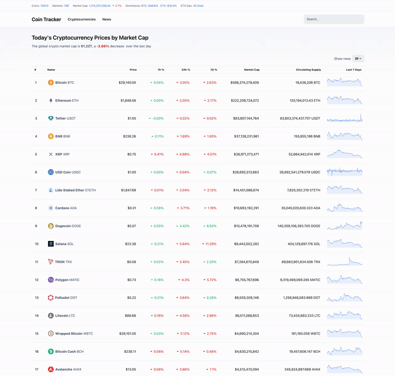

## About the project

My idea was to develop an application where individuals can effortlessly explore the world of crypto assets. The app provides an unbiased, high-quality, and precise information hub, enabling users to draw their own well-informed conclusions. By making crypto assets easily discoverable, I aimed to democratize access to reliable data and insights for everyone interested in the crypto space.

<a href="https://adambelko.github.io/coin-tracker/">Live website</a>

## Sneak Peak

## Built with

- <a href="https://react.dev/">React</a>
- <a href="https://reactrouter.com/en/main">React Router</a>
- <a href="https://styled-components.com/">Styled Components</a>
- <a href="https://www.chartjs.org/">Chart.js</a>
- <a href="https://www.coingecko.com/">Coingecko API</a>
- <a href="https://finnhub.io/">Finnhub API</a>
